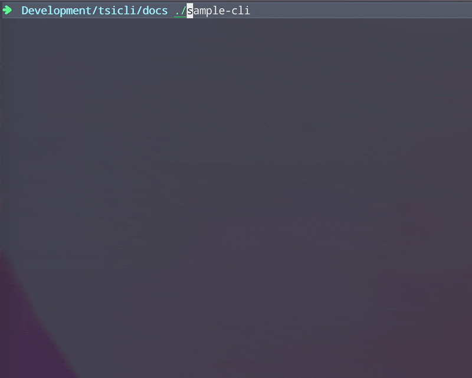

# tsicli

TypeScirpt Interactive CLI Builder

## Goal & Philisophy

`tsicli` can make it easy to manage complex arguments of CLI application.

`tsicli` is setup and operate through the following process.

- Define types you can use in the arguments.
- Define arguments.
- Define runners matching with arguments you defined.
- If input values can't fulfill the arguments, then `tsicli` provides autocomplete prompt (like `fzf`) .

## Installation

```typescript
# npm
$ npm install --save tsicli

# yarn
$ yarn add tsicli
```

## Setup & Usage

<p></p>

```typescript
import { tsicli } from "tsicli";

tsicli(process.argv, {
  /* Defining types */
  types: {
    "#name": "string",
    "#recordIds": "number[]",
    "#yesOrNo": "boolean",
  },
  /* Defining args */
  args: [
    ["practice", "name", "#name"],
    ["practice", "records", "#recordIds"],
    ["practice", "question", "#yesOrNo"],
    ["practice", "single"],
    ["action", "subAction1"],
    ["action", "subAction2"],
  ],
  /* Defining runners */
  runners: {
    practice_name,
    practice_records,
    practice_question,
    practice_single,
    action_subAction1,
    action_subAction2,
  },
});
```

## Examples

### no arguments

```typescript
tsicli(process.argv, {
  /* Defining types */
  types: {},
  /* Defining args */
  args: [["practice", "single"]],
  /* Defining runners */
  runners: {
    practice_single,
  },
});
```

### primitive arguments

```typescript
tsicli(process.argv, {
  /* Defining types */
  types: {
    "#name": "string",
    "#recordIds": "number[]",
    "#yesOrNo": "boolean",
  },
  /* Defining args */
  args: [
    ["practice", "name", "#name"],
    ["practice", "records", "#recordIds"],
    ["practice", "question", "#yesOrNo"],
  ],
  /* Defining runners */
  runners: {
    practice_name,
    practice_records,
    practice_question,
  },
});
```

| Primitive Type | Note                                 |
| -------------- | ------------------------------------ |
| string         | String                               |
| string[]       | String List (separated by comma `,`) |
| number         | Number                               |
| number[]       | Number List (separated by comma `,`) |
| boolean        | Boolean (it prompts `y/n`)           |

### Customizing prompts

You can use `PromptObj` to type definition.
For more details in `PromptObj`, you can find it [`prompts`](https://www.npmjs.com/package/prompts) package document.

```typescript
tsicli(process.argv, {
  /* Defining types */
  types: {
    "#smdId": {
      type: "autocomplete",
      name: "#smdId",
      message: "Please input #smdId",
      choices: [
        { title: "Brand", value: "Brand" },
        { title: "Category", value: "Category" },
        { title: "Product", value: "Product" },
      ],
    },
    "#recordIds": "number[]",
  },
  /* Defining args */
  args: [["fixture", "import", "#smdId", "#recordIds"]],
  /* Defining runners */
  runners: {
    fixture_import,
  },
});
```
